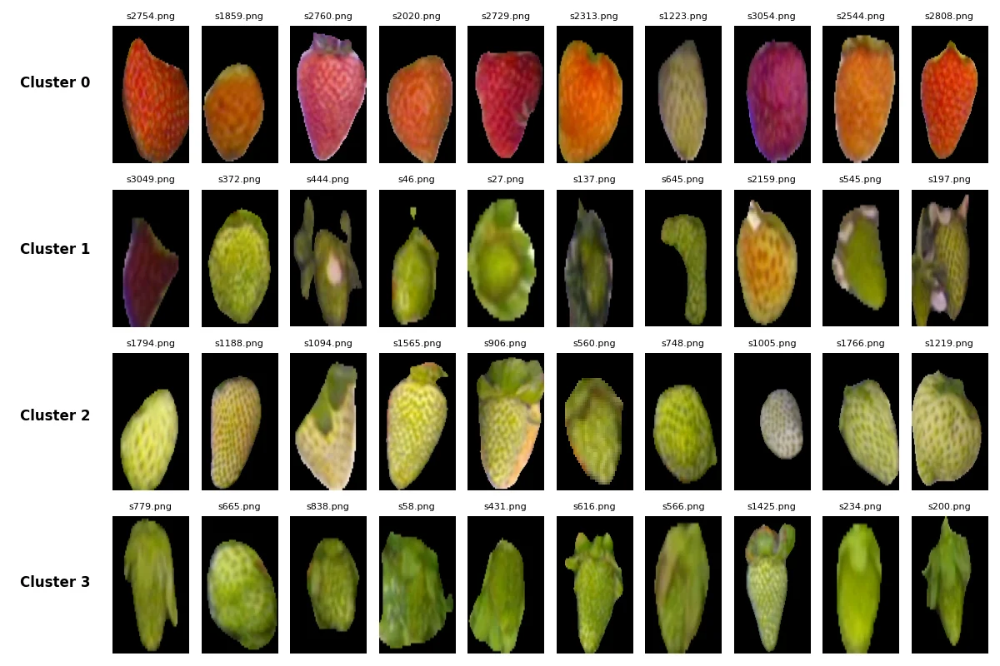
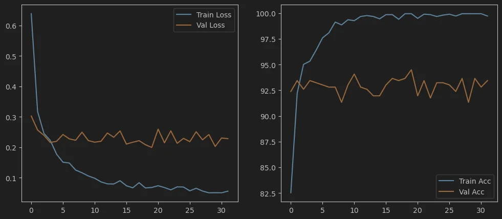
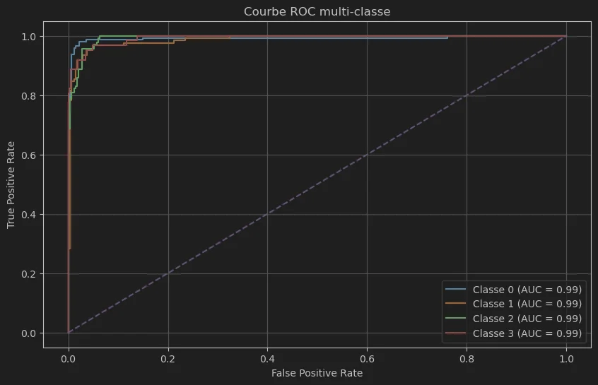
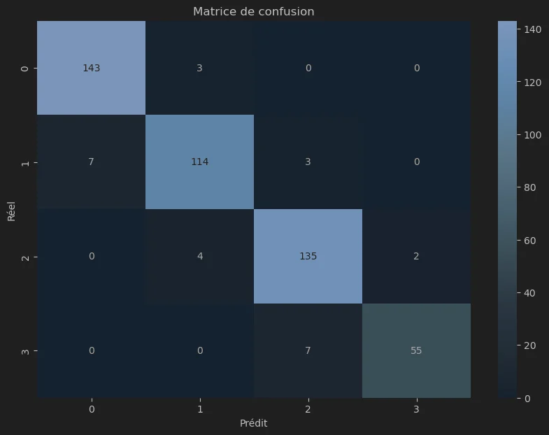

# 🍓 Strawberry Ripeness Classification


Automated classification of strawberry ripeness stages for industrial production. Compares **unsupervised clustering (K-Means)** vs **deep learning (ResNet18)**.

<p align="center">
  
</p>

---

## 🎯 Problem

Classify strawberries into **4 ripeness stages**:

| Class | Stage | Color |
|:-----:|-------|-------|
| 0 | Unripe | 🟢 Green |
| 1 | Semi-ripe | 🟡 Yellow-green |
| 2 | Almost ripe | 🟠 Orange |
| 3 | Ripe | 🔴 Red |

---

## 🔬 Methods

| Approach | Method | Accuracy |
|----------|--------|:--------:|
| **Unsupervised** | K-Means + Color Descriptors | 67.9% |
| **Supervised** | ResNet18 (fine-tuned) | **94.5%** ✅ |

---

## 📊 Results

### K-Means Clustering

Tested 6 configurations (3 color spaces × 2 descriptors):

| Model | Silhouette ↑ | Accuracy ↑ | ARI ↑ |
|-------|:------------:|:----------:|:-----:|
| RGB + histogram2d | 0.567 | 0.650 | **0.434** |
| RGB + mean | 0.394 | 0.511 | 0.314 |
| HSV + histogram2d | 0.403 | 0.487 | 0.181 |
| HSV + mean | 0.439 | 0.584 | 0.231 |
| Lab + histogram2d | **0.895** | 0.312 | -0.003 |
| **Lab + mean** | 0.466 | **0.679** | 0.404 |

**Best:** Lab + mean (67.9% accuracy)

---

### CNN Classification (ResNet18)

<p align="center">
  
</p>

| Metric | Value |
|--------|:-----:|
| **Accuracy** | 94.51% |
| **F1-Score** | 0.95 |
| **AUC-ROC** | 0.99 |

<p align="center">
  
  
</p>

---

## 🚀 Usage

```bash
# Clone
git clone https://github.com/Noemie21/Strawberry-Ripeness.git
cd Strawberry-Ripeness
pip install -r requirements.txt

# K-Means clustering
python run_clustering.py --color_space Lab --descriptor mean

# CNN training
python train.py --model resnet18 --epochs 30
```

---

## 📁 Structure

```
Strawberry-Ripeness/
├── classifier.py         # K-Means clustering
├── dataset.py            # PyTorch Dataset
├── model.py              # CNN architectures
├── train.py              # Training script
├── run_clustering.py     # Clustering experiments
├── utils.py              # Utilities
└── assets/               # Result visualizations
```

> 📦 Dataset (~4000 images) not included due to size.

---

## 🎯 Key Takeaways

- **K-Means** achieves ~68% accuracy without labels — good for prototyping
- **ResNet18** achieves **94.5% accuracy** with AUC = 0.99
- Lab color space works best for unsupervised clustering
- Most errors occur between adjacent ripeness stages

---


## 📄 License

MIT License
